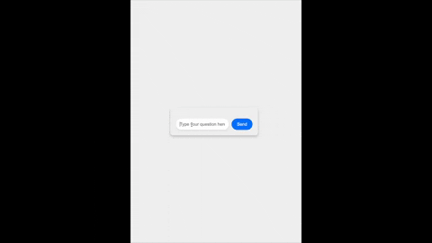

# KnowMyDoc


[](https://github.com/psf/black?style=flat-square)

<p align="center">
    
</p>
<p align="center">
    <em><b>KnowMyDoc Chat</b></em>
</p>

KnowMyDoc is a GPT3.5 powered Python-based conversational AI tool that enables users to build a reference enabled chatbot by utilizing advanced machine learning techniques and natural language processing (NLP) algorithms. The utility is fully containerized and API-driven, which allows for a seamless and rapid chatbot creation experience.

KnowMyDoc leverages the [LangChain](https://github.com/hwchase17/langchain) library for LLM prompt engineering and conversation chaining. Users can easily customize the chatbot's prompts and personalize its responses based on the context and tone of the conversation. KnowMyDoc's LLM-based approach ensures that the chatbot can maintain a consistent and coherent conversation even when dealing with large amounts of data and provide relevant sources per response. The chatbots also remain in the confines of provided knowledge.

In addition, KnowMyDoc utilizes the Chroma vector similarity search engine to enable fast and efficient lookup of relevant data. By creating embeddings of users' documents and web pages, KnowMyDoc can quickly identify and retrieve the most relevant information for the user's queries.

Other features of KnowMyDoc include:

* Support for loading documents from local data sources and web urls
* Support for persona and message tone
* AI qa limited to knowledge sources
* Text splitting to optimize indexing and similarity search
* NLTK support for text processing and tokenization
Support for OpenAI embeddings and vector stores, including Chroma
* Logging support for troubleshooting and analysis

## Getting Started
To use this utility:
1. Clone the repository
```
git clone https://github.com/jainsid24/know-my-doc
```
2. Build the Docker image by running the following command in the terminal:
```
docker build -t know-my-doc:latest .
```
3. Once the image is built, run the Docker container using the following command:
```
docker run -p 5001:5001 know-my-doc
```
4. Use curl/postman for API call
```
curl --header "Content-Type: application/json" \
     --request POST \
     --data '{"question": "When was JWST launched?"}' \
     http://<pods-ip-address>:5001/api/chat
```

## Configuration

Before you can use the utility, you need to set up the configuration file. The configuration file is a YAML file that contains the following options:

* openai_api_key: Your OpenAI API key.
* data_directory: The directory where your local data sources are located.
* data_files_glob: A glob pattern that specifies which files in data_directory to use as data sources.
* webpages: A list of URLs of webpages to use as data sources.
* tone: The tone to use for the chatbot's responses (e.g., "formal", "informal", "friendly", etc.).
* persona: The persona to use for the chatbot.
* You can copy the config.example.yaml file to config.yaml and modify the options as needed.

## Usage

To start the chatbot, run:

```
python app.py
```

This will start the chatbot on port 5000.

To use the chatbot, send a POST request to http://localhost:5000/api/chat with a JSON payload containing the question to ask, like this:

```
curl -X POST \
  http://localhost:5000/api/chat \
  -H 'Content-Type: application/json' \
  -d '{"question": "What is the capital of France?"}'
```

This will return a JSON response containing the chatbot's answer to the question:

```
{"response": "The capital of France is Paris."}
```

## Contributing

If you find a bug or have an idea for a new feature, please open an issue or submit a pull request.

## License

This project is licensed under the MIT License. See the LICENSE file for details.
